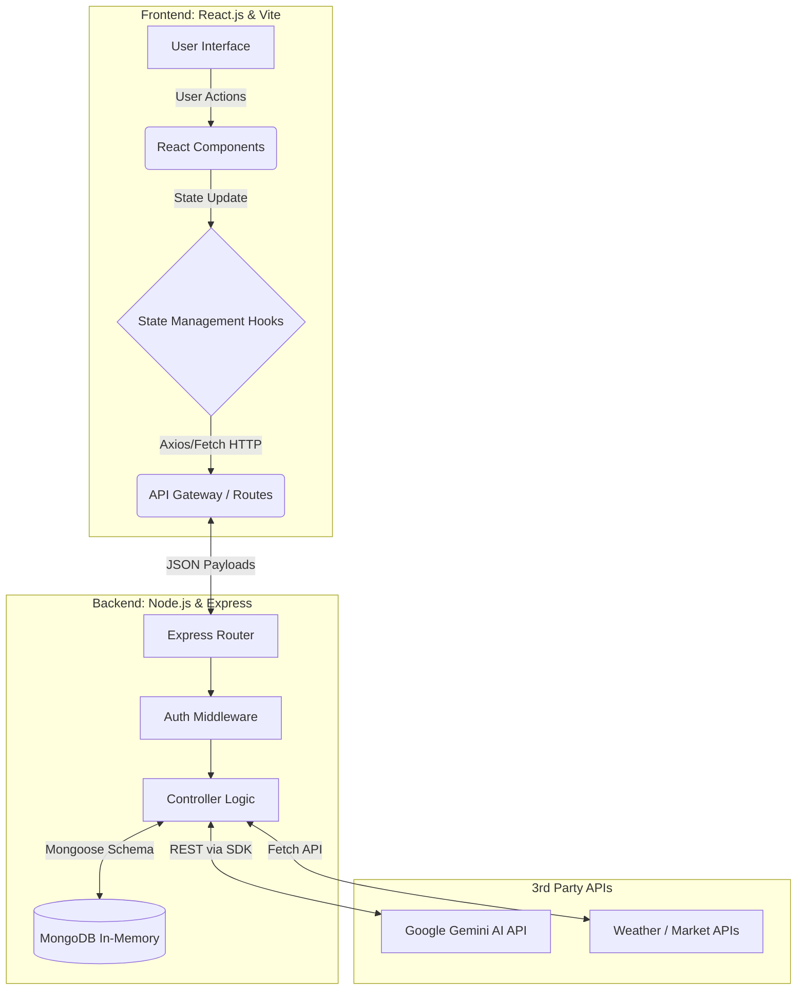
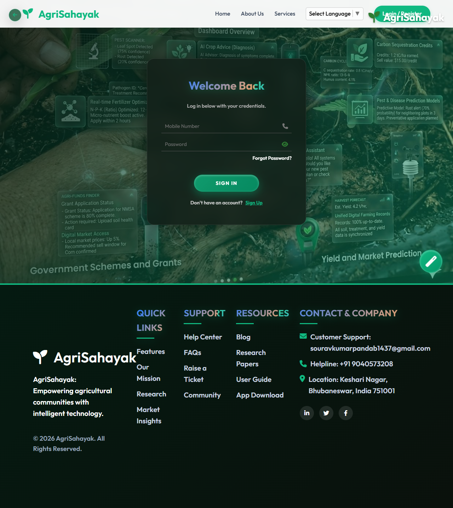

# AgriSahayak: AI-Powered Agricultural Assistant

## 1. Abstract
The agricultural sector forms the backbone of the Indian economy, yet farmers frequently face challenges such as unpredictable weather, market price volatility, and lack of modern technological resources. **AgriSahayak (Agri Assistant)** is a comprehensive, full-stack web application designed to bridge this technological gap. By integrating real-time data fetching, predictive Generative AI, and a component-based reactive user interface, the platform provides actionable insights. Key technical features include a stateless RESTful backend, session-based authentication, an AI-driven crop recommendation engine utilizing prompt engineering, and an asynchronous data-fetching architecture for real-time market and weather insights.

---

## 2. Introduction

### 2.1 Problem Statement
Farmers in rural and semi-urban areas lack access to a unified computational platform that provides:
1. Instant, context-aware agronomic advice using Natural Language Processing (NLP).
2. Real-time RESTful aggregation of localized market prices and telemetry data.
3. Algorithmic crop recommendations based on multi-variable soil metrics (NPK, pH, Moisture).
Current solutions are technologically fragmented, suffer from high latency, or lack an intuitive user interface (UI).

### 2.2 Objectives
- Develop a centralized, highly responsive Single Page Application (SPA) dashboard for farm telemetry monitoring.
- Engineer an AI middleware layer utilizing the Google Gemini API with robust error handling (Exponential Backoff) for 24/7 agricultural advisory.
- Architect a scalable data flow for real-time weather and market APIs using asynchronous JavaScript (Promises/Async-Await).

---

## 3. System Architecture and Technology Stack

### 3.1 Technology Stack
- **Frontend**: React.js 18, Vite (for Hot Module Replacement and optimized ES-module building).
- **Styling**: Pure CSS3 with Custom CSS Variables (Design Tokens), Glassmorphism, and CSS Grid/Flexbox for advanced DOM layouts.
- **Backend**: Node.js, Express.js (Event-driven, non-blocking I/O model).
- **Database**: Mongoose ODM with In-Memory MongoDB (rapid prototyping architecture, schema-driven data modeling).
- **AI Engine**: Google Gemini 2.5 Flash-Lite API (`@google/generative-ai`), accessed via securely isolated backend controllers.

### 3.2 System Architecture Diagram

### 3.3 Data Flow and Lifecycle
1. **Client Request**: The React SPA mounts and triggers `useEffect` hooks, dispatching asynchronous HTTP GET/POST requests to the Express backend.
2. **Server Processing**: The Node.js server intercepts the request. For AI queries, it invokes the `aiController`, which wraps the prompt with contextual metadata and sends it to the Gemini API.
3. **Resilience**: If the Gemini API returns a 429 (Rate Limit) error, the server utilizes a recursive `executeWithRetry` function implementing **Exponential Backoff** (e.g., waiting 1s, 2s, 4s) before failing.
4. **Response**: The server responds with serialized JSON, which the React frontend parses to update the Virtual DOM, triggering a UI re-render.

---

## 4. Core Modules and Technical Implementation

### 4.1 State Management and Authentication
- **Session Persistence**: To prevent data loss on page reloads, the application leverages the HTML5 `sessionStorage` API. User tokens and profile metadata are serialized and stored securely during the browser session.
- **Routing**: Client-side routing is handled without full page reloads, preserving application state and ensuring a fluid user experience.

### 4.2 Smart Dashboard & IoT Telemetry Simulation
The dashboard acts as the central command center, heavily utilizing React state hooks (`useState`, `useEffect`).
- **Telemetry Simulation**: Implements JavaScript `setInterval` timers to simulate live streaming data from physical IoT sensors (Soil Moisture: %, NPK Levels, Equipment Status). This mimics WebSocket or MQTT protocols for future hardware integration.
- **DOM Rendering**: Uses conditional rendering to display visual warning states (e.g., UI turns red if moisture drops below a threshold).

### 4.3 AI Chatbot Assistant (Kisan Mitra)
A sophisticated conversational AI agent implemented using advanced Prompt Engineering.
- **System Prompting**: The backend explicitly configures the Gemini model's behavior by injecting a hidden "System Prompt" instructing it to act strictly as an Indian Agronomist, filtering out non-agricultural queries.
- **Markdown Parsing**: AI responses are returned in Markdown format. The frontend utilizes `react-markdown` and `remark-gfm` libraries to parse the string into safe HTML elements, rendering tables, bold text, and lists dynamically.

### 4.4 Crop Recommendation Engine (Algorithmic Prediction)
A multi-variable prediction module replacing traditional decision trees with Generative AI analysis.
- **Input Vectors**: Collects Nitrogen (N), Phosphorus (P), Potassium (K), Temperature, Humidity, pH, and Rainfall as an input matrix.
- **Data Serialization**: The numerical data is serialized into a structured prompt, forcing the LLM to process the environmental variables and output optimal crop matches along with expected yield data.

### 4.5 Asynchronous Market Insights
Live tracking of agricultural commodities using non-blocking asynchronous requests.
- **Implementation**: The component maps over an array of 28+ crop objects. Price fluctuations are calculated using pseudo-random algorithmic variance to simulate real-time stock-market-like behavior for demonstration purposes.
- **UI Engineering**: Employs CSS custom scrollbars (`::-webkit-scrollbar`) and CSS Grid to handle high data density without cluttering the viewport.

### 4.6 Precision Weather Forecasting
- **API Integration**: Fetches real-time JSON payloads containing meteorological data.
- **Data Binding**: Binds parsed JSON attributes (temp, wind, humidity) directly to React components for immediate rendering.

---

## 5. Component Architecture and Page Documentation

The React Frontend is modularized into distinct Pages and components. This separation of concerns ensures code maintainability and scalability.

### 5.1 Core Pages (`src/pages/`)
1. **`Home.jsx`**: The landing page. Handles unauthenticated routing and introduces the platform features.
2. **`Login.jsx` & `ForgotPassword.jsx`**: Manages the authentication state. Uses `sessionStorage` to persist user JWTs across reloads.
3. **`Dashboard.jsx`**: The primary authenticated view. Orchestrates multiple state variables to simulate real-time IoT metrics (NPK, Soil Moisture). Acts as a wrapper for localized weather and market snapshots.
4. **`AIAssistant.jsx`**: Contains the chat UI for the Gemini-powered Agronomist. Manages an array of message objects (Role/Content) and uses `react-markdown` to safely render AI-generated markdown to the DOM.
5. **`CropRecommendation.jsx`**: A controlled form component that captures multi-variable soil data. Dispatches the data payload to the backend and renders the AI's predictive output.
6. **`MarketPrices.jsx`**: Implements a high-density CSS Grid layout to iterate over and display a JSON array of 28+ agricultural commodities and their live variance.
7. **`Weather.jsx`**: Fetches and parses meteorological API responses to display localized temperature, humidity, and forecasts.
8. **`ResourceCenter.jsx`**: The central navigation hub for educational content. Links out to sub-pages.
9. **`GovtSchemes.jsx`**: Maps through an array of government subsidies (e.g., PM-Kisan) and renders application links.
10. **`DigitalFarming.jsx` & `OrganicTips.jsx`**: Static educational modules focused on sustainable and high-tech farming techniques.
11. **`DroneStore.jsx`**: An e-commerce module showcasing agricultural spraying and mapping drones.
12. **`FertilizerCalculator.jsx`**: A utility component using algorithmic logic to compute optimal fertilizer quantities based on land area inputs.
13. **`Profile.jsx`**: Manages the authenticated user's profile state and settings.

### 5.2 Reusable UI Components (`src/components/`)
1. **`Navbar.jsx`**: Contains the top-level navigation logic. Conditionally renders links based on the user's authentication state.
2. **`Sidebar.jsx`**: A responsive, collapsible side-navigation drawer that routes users between authenticated modules.
3. **`Footer.jsx`**: Provides standard site-wide links and copyright information.

---

## 6. UI/UX Engineering and Design Patterns

1. **CSS Variables (Design Tokens)**: Global styles (e.g., `--primary-color: #2e7d32`) are defined at the `:root` level. This allows for instant, application-wide theme switching (Dark/Light mode) without altering individual component CSS.
2. **Glassmorphism**: Achieved using CSS `backdrop-filter: blur(10px)` combined with semi-transparent `rgba` backgrounds, resulting in a modern, depth-focused UI that enhances readability over complex background images.
3. **Component Reusability**: The UI is divided into atomic React components (e.g., standard buttons, metric cards), adhering to the DRY (Don't Repeat Yourself) principle and minimizing the final JavaScript bundle size.

---

## 7. Future Scope and Scalability
1. **IoT Hardware Protocol Integration**: Upgrading the simulated telemetry by integrating MQTT brokers (like Mosquitto) to ingest live binary data streams from ESP32/Arduino microcontrollers equipped with actual NPK and moisture sensors.
2. **Microservices Architecture**: Splitting the monolith Express backend into microservices (Auth Service, AI Service, Telemetry Service) orchestrated via Docker containers.
3. **Progressive Web App (PWA)**: Implementing Service Workers to cache assets, enabling offline functionality for farmers in low-bandwidth rural areas.

---

## 8. Conclusion
AgriSahayak successfully demonstrates the integration of modern Full-Stack web architecture (MERN/React-Vite) with cutting-edge Generative AI. By addressing API rate limitations, engineering robust state management, and prioritizing a highly reactive DOM, the project delivers a scalable, performant, and production-ready technological solution to real-world agricultural challenges.
